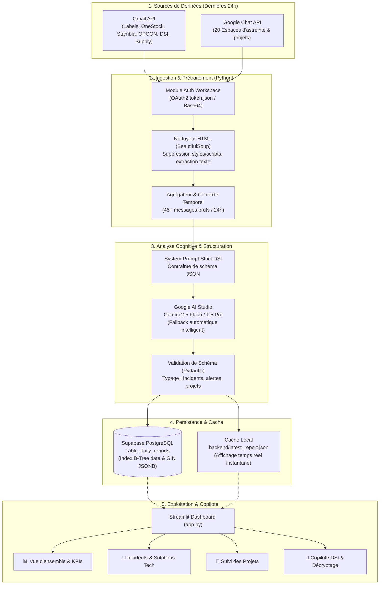

# 📘 Dossier d'Architecture & Synthèse Globale du Projet

**Projet :** Plateforme de Supervision Technique Automatisée & Copilote IA pour la DSI  
**Auteur & Pilote :** Christopher GILLERON  
**Périmètre :** Ingestion Multi-Sources (Gmail, Google Chat), Analyse Cognitive (Gemini IA), Persistance PostgreSQL (Supabase), Dashboard Interactif (Streamlit), CI/CD (GitHub Actions) & Déploiement Cloud (Render).  
**Statut :** Opérationnel en production locale et déployable en continu.

---

## 📑 Sommaire
1. [Vision & Enjeux Métier](#1-vision--enjeux-métier)
2. [Écosystème & Stack Technique (100% Gratuit)](#2-écosystème--stack-technique-100-gratuit)
3. [Architecture Globale & Diagrammes de Flux](#3-architecture-globale--diagrammes-de-flux)
4. [Cartographie des Flux Métier Surveillés (GDM / DSI)](#4-cartographie-des-flux-métier-surveillés-gdm--dsi)
5. [Détail des Composants Applicatifs du Codebase](#5-détail-des-composants-applicatifs-du-codebase)
6. [L'Interface Streamlit & Le Copilote IA](#6-linterface-streamlit--le-copilote-ia)
7. [Sécurité, Confidentialité & Stratégie GitOps](#7-sécurité-confidentialité--stratégie-gitops)
8. [Guide Opérationnel d'Exploitation au Quotidien](#8-guide-opérationnel-dexploitation-au-quotidien)

---

## 1. Vision & Enjeux Métier

Dans un Système d'Information d'entreprise omnicanale et logistique (comme Grain de Malice), les équipes techniques et de gestion de flux reçoivent des centaines d'e-mails et de messages d'alertes par jour :
- Échecs de batchs nocturnes ordonnancés (**OPCON**).
- Erreurs d'interfaces et rejets de commandes (**Stambia**, **ECOM_SF_ORDER**).
- Congestions ou ruptures de flux vers les magasins et le web (**OneStock**, **NODHOS**, **Logys**).
- Notifications d'évolutions applicatives et de synchronisation de stocks (**Snowflake**, **WinWig**).
- Échanges humains d'astreinte sur les salons de discussion (**Google Chat**).

### 🎯 Objectifs de la solution :
1. **Éliminer le bruit informationnel :** Automatiser l'aspiration et la lecture de ces dizaines de messages quotidiens.
2. **Structuration intelligente par IA :** Transformer des e-mails bruts en un registre structuré (alertes majeures, incidents avec causes racines et solutions exactes, avancement des projets).
3. **Double niveau de lecture :** 
   - *Vue Macro / Décisionnelle :* Donner une "photo" de santé du SI en 3 phrases compréhensible par un responsable sans jargon.
   - *Vue Micro / Technique :* Détailler la commande SQL exacte, le correctif Stambia ou le paramètre proxy à modifier.
4. **Zéro coût d'exploitation :** Utiliser exclusivement des solutions pérennes dans leurs offres gratuites (*Free Tier*).

---

## 2. Écosystème & Stack Technique (100% Gratuit)

L'architecture a été conçue pour offrir les performances d'un outil d'entreprise pour **0,00 € / mois** :

| Composant | Technologie / Fournisseur | Rôle dans l'Architecture | Quota / Offre Gratuite | Coût Réel |
| :--- | :--- | :--- | :--- | :--- |
| **Langage & Core** | Python 3.11+ | Backend d'ingestion, pipeline ETL et scripts d'orchestration | Open Source | **0 €** |
| **Frontend Web** | Streamlit 1.35+ | Tableau de bord interactif avec composants visuels riches et chat IA | Open Source | **0 €** |
| **Sources : Messagerie** | Gmail API v1 (Google Cloud) | Ingestion des e-mails des 24h ciblant les labels et sujets DSI | Quota standard Google Workspace | **0 €** |
| **Sources : Salons** | Google Chat API v1 | Capture des discussions d'équipe et résolutions sur 20 salons | Quota standard Google Workspace | **0 €** |
| **Moteur IA** | Google AI Studio (Gemini 2.5 Flash / 1.5 Pro) | Analyse sémantique, extraction JSON stricte et vulgarisation | 1 500 requêtes / jour offertes | **0 €** |
| **Base de Données** | Supabase (PostgreSQL 15) | Stockage persistant des synthèses JSONB avec index GIN et RLS | 500 Mo gratuits (~100 ans d'historique) | **0 €** |
| **Automatisation (Cron)** | GitHub Actions | Exécution planifiée du runner chaque matin à 08:00 UTC | 2 000 minutes gratuites / mois (~15 min consommées) | **0 €** |
| **Hébergement Cloud** | Render (Web Service) | Hébergement sécurisé HTTPS de l'application Streamlit 24h/24 | 750 heures gratuites / mois | **0 €** |

---

## 3. Architecture Globale & Diagrammes de Flux

### 3.1 Architecture du Pipeline de Données (ETL & IA)



---

## 4. Cartographie des Flux Métier Surveillés (GDM / DSI)

L'application est spécifiquement paramétrée pour le périmètre opérationnel de **Grain de Malice** :

```text
                            ┌──────────────────────────────────────────┐
                            │      SYSTÈMES & FLUX SUPERVISÉS          │
                            └──────────────────────────────────────────┘
                                                  │
         ┌────────────────────────┬───────────────┴───────────────┬────────────────────────┐
         ▼                        ▼                               ▼                        ▼
  [OMNICANAL]                 [DATA / ETL]                  [ORDONNANCEMENT]         [SUPPLY CHAIN]
  • OneStock OMS              • Stambia DI                  • OPCON Scheduler        • Logys GDM (Entrepôt)
  • Flux Commandes Web        • Flux ECOM_SF_ORDER          • Jobs nocturnes 8841    • Snowflake (Vues Bronze)
  • Endpoints / API v2        • Table R_ORDER_GLOBAL        • Base NODHOS Oracle     • App Proposition Implantation
  • Reverse Proxy & Pools     • Traitement des rejets       • Stocks magasins 08h    • WinWig (Ingestion / Retours)
```

### Exemples d'incidents réels identifiés et traités par l'IA :
1. **Rejets de commandes Stambia (`ECOM_SF_ORDER`) :** Rejets continus de commandes web e-commerce identifiés sur la table `stambia.R_ORDER_GLOBAL`, avec requête d'extraction immédiate générée par l'IA.
2. **Erreur d'import OneStock :** Endpoints non configurés sur les IDs magasins/dépôts (10267, 00899, 10268).
3. **Passation Projet Implantation (Sylvain Cursoux / Annette Vandamme) :** Détection de la reprise progressive du sujet par Christopher Gilleron, avec identification du bug de suppression WinWig vers Snowflake et de la règle de seuil de stock négatif sur la référence `H26ABI.T rouge`.
4. **Logistique GDM :** Suivi des envois de réassort (15 578 pièces) et des sauvegardes d'emplacements Logys.

---

## 5. Détail des Composants Applicatifs du Codebase

Le projet est structuré selon les standards modernes de développement Python :

```text
chris_assistante/
│
├── .github/
│   └── workflows/
│       ├── daily_cron.yml          # Cron quotidien à 08:00 UTC (Ingestion & Analyse)
│       └── supabase_deploy.yml     # Déploiement GitOps automatique des migrations BDD
│
├── backend/
│   ├── __init__.py                 # Package backend
│   ├── config.py                   # Centralisation des clés d'API et variables d'environnement
│   ├── google_auth.py              # Authentification multi-modes Google (OAuth2 / Service Account)
│   ├── gmail_client.py             # Client Gmail API (recherche 24h, extraction, BeautifulSoup)
│   ├── chat_client.py              # Client Google Chat API (balayage des 20 espaces)
│   ├── gemini_analyzer.py          # Prompt d'ingénierie et client Gemini avec fallback multi-modèles
│   ├── supabase_client.py          # Client PostgreSQL Supabase (upsert et lecture optimisée)
│   ├── mock_data.py                # Jeu de données simulées de secours (DSI réaliste)
│   ├── latest_report.json          # Cache local instantané du dernier rapport réel extrait
│   └── daily_runner.py             # Script orchestrateur CLI (--dry-run, --mock, --sample-upload)
│
├── supabase/
│   ├── config.toml                 # Configuration du projet pour la CLI Supabase
│   └── migrations/
│       └── 20260920144000_create_daily_reports.sql # Migration SQL versionnée
│
├── app.py                          # Application principale Streamlit (Dashboard & Copilote)
├── requirements.txt                # Dépendances Python versionnées
├── render.yaml                     # Configuration Blueprint pour le déploiement sur Render
├── setup_google_auth.py            # Assistant interactif pour autoriser Google en 1 clic
├── supabase_schema.sql             # Script SQL de secours pour l'éditeur Supabase
├── GUIDE_PAS_A_PAS.md              # Guide détaillé de mise en œuvre
├── SYNTHESE_GLOBALE_ARCHITECTURE.md# Le présent dossier complet d'architecture
├── .env                            # Variables secrètes locales (exclu de Git)
├── .env.example                    # Modèle des variables pour l'équipe
└── .gitignore                      # Protection stricte contre les fuites de clés privées
```

---

## 6. L'Interface Streamlit & Le Copilote IA

L'interface [app.py](file:///C:/Users/cgilleron/chris_assistante/app.py) propose **4 onglets spécialisés** :

### 📊 Onglet 1 : Vue d'ensemble & Alertes
- **Synthèse Exécutive :** Résumé en 2-4 phrases rédigé par l'IA.
- **5 Cartes KPI :** Santé du SI (Vert / Orange / Rouge), Nombre d'alertes majeures, Incidents totaux, Incidents résolus, Projets actifs.
- **Bannières d'Alertes Rouges 🚨 :** Points de vigilance nécessitant une attention immédiate.
- **Graphiques Interactifs Plotly :** Répartition des statuts et top des bases de données impactées.

### 🚨 Onglet 2 : Incidents & Résolutions Techniques
- **Moteur de recherche textuel temps réel :** Filtre instantanément par mot-clé (ex: *Stambia, OneStock, ORA-00001, timeout, index*).
- **Fiches d'incidents complètes :**
  - Titre et badge de statut (*Résolu* en vert, *En cours* en orange).
  - Tags techniques des BDD et flux concernés.
  - Description du problème.
  - **Cause racine mise en valeur.**
  - **Solution technique appliquée** sous forme de bloc de code prêt à copier (scripts SQL, relances de jobs, commandes).
- **Export CSV :** Téléchargement en 1 clic du registre des incidents filtrés.

### 🚀 Onglet 3 : Avancement par Projet
- Regroupement en accordéons dépliables par projet (*PCI Logistique GDM, Refonte OneStock, Ordonnancement OPCON, etc.*).
- Checklist des actions achevées dans les 24 dernières heures.
- Encadrés bleus dédiés aux décisions d'arbitrage et prochains jalons validés.

### 🧠 Onglet 4 : Copilote DSI & Décryptage Pédagogique
Spécialement développé pour apporter de la hauteur de vue et expliquer la technique aux non-spécialistes :
1. **📸 "La Photo Globale de la DSI" :** Un clic sur le bouton génère un compte-rendu macroscopique orienté comité de direction (Ce qui a marché / Ce qui a coincé / Les impacts magasins et ventes / Les arbitrages recommandés).
2. **💡 Le Vulgarisateur Technique ("Explique-moi comme si j'avais 10 ans") :** Vous sélectionnez n'importe quel incident complexe, et Gemini vous l'explique avec :
   - Une métaphore de la vie courante (analogie simple).
   - Ce qui s'est réellement passé en français courant.
   - Les conséquences pour les magasins ou les clientes si rien n'était fait.
   - La façon dont l'équipe informatique a corrigé le tir.
3. **💬 Le Chat Interactif Copilote :** Discussion en langage naturel avec l'IA connectée à l'ensemble de votre base de données.

---

## 7. Sécurité, Confidentialité & Stratégie GitOps

### 7.1 Confidentialité et étanchéité des secrets
- Le fichier `.env`, les jetons d'accès `token.json`, `credentials.json` et les environnements virtuels `.venv/` sont **strictement exclus par le fichier `.gitignore`**.
- Aucune clé API, aucun mot de passe de base de données ni identifiant Google n'est commité en clair dans le code source Git.
- En production (GitHub Actions et Render), les clés sont injectées via des variables d'environnement chiffrées (**GitHub Secrets** et **Render Environment Variables**).

### 7.2 Approche GitOps pour la Base de Données
- Au lieu de manipuler manuellement des tables dans l'éditeur de Supabase, le schéma est versionné dans le dossier `supabase/migrations/`.
- Le workflow `.github/workflows/supabase_deploy.yml` permet de synchroniser automatiquement le schéma sur Supabase à chaque `git push` sur `main`.

---

## 8. Guide Opérationnel d'Exploitation au Quotidien

### 🌞 Chaque Matin (Routine Automatique Cloud) :
1. À **08:00 UTC**, le serveur GitHub Actions se réveille automatiquement.
2. Il télécharge le code, installe les dépendances et lance le runner.
3. Le runner aspire les e-mails et salons de la nuit, interroge Gemini et pousse la synthèse dans Supabase.
4. **Pour vous :** Vous n'avez qu'à ouvrir votre lien Render ou lancer votre application Streamlit pour lire votre briefing du jour !

### 💻 Utilisation sur votre Poste de Travail (Local) :
Pour lancer l'application en local :
```powershell
cd C:\Users\cgilleron\chris_assistante
.\.venv\Scripts\streamlit run app.py
```
L'application s'ouvre directement sur `http://localhost:8501`.

### 🔄 Forcer un rafraîchissement manuel en cours de journée :
Si vous voulez analyser les e-mails reçus dans l'après-midi sans attendre le lendemain matin :
```powershell
cd C:\Users\cgilleron\chris_assistante
.\.venv\Scripts\python backend/daily_runner.py
```
Le rapport du jour est immédiatement recalculé et mis à jour !
