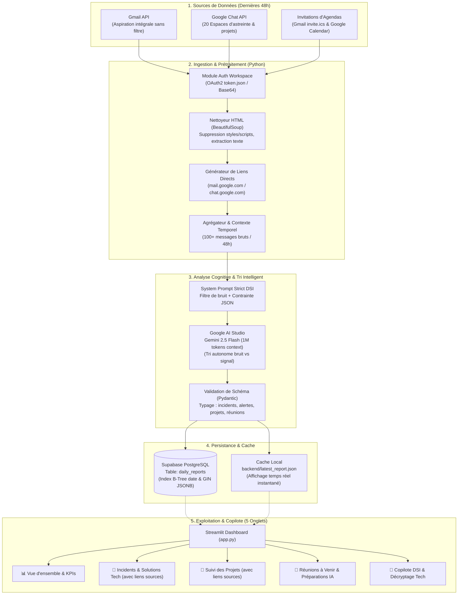

# 📘 Dossier d'Architecture & Synthèse Globale du Projet

**Projet :** Plateforme de Supervision Technique Automatisée & Copilote IA pour la DSI  
**Auteur & Pilote :** Christopher GILLERON  
**Périmètre :** Ingestion Multi-Sources (Gmail 48h sans filtre, Google Chat, Google Calendar / Invitations), Analyse Cognitive (Gemini 2.5 Flash), Persistance PostgreSQL (Supabase), Dashboard Interactif 5 Onglets (Streamlit), CI/CD (GitHub Actions) & Déploiement Cloud (Render).  
**Statut :** Opérationnel en production locale et déployable en continu.

---

## 📑 Sommaire
1. [Vision & Enjeux Métier](#1-vision--enjeux-métier)
2. [Écosystème & Stack Technique (100% Gratuit)](#2-écosystème--stack-technique-100-gratuit)
3. [Architecture Globale & Diagrammes de Flux](#3-architecture-globale--diagrammes-de-flux)
4. [Cartographie des Flux Métier Surveillés (GDM / DSI)](#4-cartographie-des-flux-métier-surveillés-gdm--dsi)
5. [Détail des Composants Applicatifs du Codebase](#5-détail-des-composants-applicatifs-du-codebase)
6. [L'Interface Streamlit (Les 5 Onglets Opérationnels)](#6-linterface-streamlit-les-5-onglets-opérationnels)
7. [Sécurité, Confidentialité & Traçabilité des Sources](#7-sécurité-confidentialité--traçabilité-des-sources)
8. [Guide Opérationnel d'Exploitation au Quotidien](#8-guide-opérationnel-dexploitation-au-quotidien)

---

## 1. Vision & Enjeux Métier

Dans un Système d'Information d'entreprise omnicanale et logistique (comme Grain de Malice), les équipes techniques et de gestion de flux reçoivent des centaines d'e-mails et de messages d'alertes par jour :
- Échecs de batchs nocturnes ordonnancés (**OPCON**).
- Erreurs d'interfaces et rejets de commandes (**Stambia**, **ECOM_SF_ORDER**).
- Congestions ou ruptures de flux vers les magasins et le web (**OneStock**, **NODHOS**, **Logys**).
- Notifications d'évolutions applicatives et de synchronisation de stocks (**Snowflake**, **WinWig**).
- Échanges humains d'astreinte sur les salons de discussion (**Google Chat**).
- Multiples invitations d'agenda et points de synchronisation hebdomadaires (**Google Calendar**).

### 🎯 Objectifs de la solution :
1. **Éliminer le bruit informationnel :** Aspiration intégrale sur 48h sans aucun mot-clé manuel ; l'IA Gemini sépare elle-même le signal du bruit.
2. **Structuration intelligente par IA :** Transformer des e-mails bruts en un registre clair (alertes majeures, incidents avec causes racines et solutions exactes, avancement des projets et arbitrages).
3. **Préparation proactive des réunions :** Détecter les réunions clés d'équipe et construire automatiquement le briefing de ce que Christopher doit préparer en croisant l'ordre du jour avec les e-mails récents.
4. **Traçabilité totale :** Chaque incident, projet et réunion dispose d'un lien direct vers l'e-mail Gmail ou le salon Google Chat source.
5. **Double niveau de lecture :** 
   - *Vue Macro / Décisionnelle :* Donner une "photo" de santé du SI en 3 phrases compréhensible par un responsable sans jargon.
   - *Vue Micro / Technique :* Détailler la commande SQL exacte, le correctif Stambia ou le paramètre proxy à modifier.
6. **Zéro coût d'exploitation :** Utiliser exclusivement des solutions pérennes dans leurs offres gratuites (*Free Tier*).

---

## 2. Écosystème & Stack Technique (100% Gratuit)

L'architecture a été conçue pour offrir les performances d'un outil d'entreprise pour **0,00 € / mois** :

| Composant | Technologie / Fournisseur | Rôle dans l'Architecture | Quota / Offre Gratuite | Coût Réel |
| :--- | :--- | :--- | :--- | :--- |
| **Langage & Core** | Python 3.11+ | Backend d'ingestion, pipeline ETL et scripts d'orchestration | Open Source | **0 €** |
| **Frontend Web** | Streamlit 1.35+ | Tableau de bord interactif à 5 onglets avec composants visuels riches | Open Source | **0 €** |
| **Sources : Messagerie** | Gmail API v1 (Google Cloud) | Ingestion intégrale 48h (`newer_than:2d -in:trash -in:spam`) avec extraction d'URLs | Quota standard Google Workspace | **0 €** |
| **Sources : Salons** | Google Chat API v1 | Capture des discussions d'équipe et résolutions sur 20 salons d'astreinte | Quota standard Google Workspace | **0 €** |
| **Sources : Calendrier** | Gmail Invitations & Google Calendar | Récupération des réunions à venir et ordres du jour | Inclus dans Google Workspace | **0 €** |
| **Moteur IA** | Google AI Studio (Gemini 2.5 Flash) | Tri autonome du bruit, analyse sémantique, extraction JSON et briefing | 1 500 requêtes / jour offertes (1M tokens) | **0 €** |
| **Base de Données** | Supabase (PostgreSQL 15) | Stockage persistant des synthèses JSONB avec index GIN et RLS | 500 Mo gratuits (~100 ans d'historique) | **0 €** |
| **Automatisation (Cron)** | GitHub Actions | Exécution planifiée du runner chaque matin à 08:00 UTC | 2 000 minutes gratuites / mois | **0 €** |
| **Hébergement Cloud** | Render (Web Service) | Hébergement sécurisé HTTPS de l'application Streamlit 24h/24 | 750 heures gratuites / mois | **0 €** |

---

## 3. Architecture Globale & Diagrammes de Flux

### 3.1 Architecture du Pipeline de Données (ETL & IA)



---

## 4. Cartographie des Flux Métier Surveillés (GDM / DSI)

L'application est spécifiquement paramétrée pour le périmètre opérationnel de **Grain de Malice** :

```text
                            ┌──────────────────────────────────────────┐
                            │      SYSTÈMES & FLUX SUPERVISÉS          │
                            └──────────────────────────────────────────┘
                                                   │
         ┌────────────────────────┬───────────────┴───────────────┬────────────────────────┐
         ▼                        ▼                               ▼                        ▼
  [OMNICANAL]                 [DATA / ETL]                  [ORDONNANCEMENT]         [SUPPLY CHAIN]
  • OneStock OMS              • Stambia DI                  • OPCON Scheduler        • Logys GDM (Entrepôt)
  • Flux Commandes Web        • Flux ECOM_SF_ORDER          • Jobs nocturnes 8841    • Snowflake (Vues Bronze)
  • Endpoints / API v2        • Table R_ORDER_GLOBAL        • Base NODHOS Oracle     • App Proposition Implantation
  • Reverse Proxy & Pools     • Traitement des rejets       • Stocks magasins 08h    • WinWig (Ingestion / Retours)
```

### Exemples d'incidents et projets réels traités :
1. **Rejets de commandes Stambia (`ECOM_SF_ORDER`) :** Rejets récurrents de commandes web identifiés sur la table `stambia.R_ORDER_GLOBAL`, avec lien direct vers le mail d'alerte Stambia.
2. **Erreur d'import OneStock :** Endpoints non configurés sur les identifiants (10267, 00899, 10268) avec accès en 1 clic au message du RUN OneStock.
3. **Chantier Proposition d'Implantation (Snowflake / WinWig) :** Détection des évolutions livrées par Sylvain Cursoux, de l'arbitrage d'Annette Vandamme sur la référence `H26ABI.T rouge` et de la MEP du stock mini magasin fixée au mardi 22/09.
4. **Réunions d'équipe & Passations :** Point hebdomadaire *Data/IA - Supply* avec Marie Ducorney et Loïc Vuylsteker avec checklist des points à préparer.

---

## 5. Détail des Composants Applicatifs du Codebase

```text
chris_assistante/
├── backend/
│   ├── __init__.py                 # Package backend
│   ├── config.py                   # Centralisation des paramètres (ingestion globale 48h, modèles)
│   ├── google_auth.py              # Authentification multi-modes Google (OAuth2 / Service Account)
│   ├── gmail_client.py             # Client Gmail (aspiration intégrale 48h, extraction d'URLs web directes)
│   ├── chat_client.py              # Client Google Chat (balayage des 20 espaces d'astreinte)
│   ├── meetings_client.py          # Client de capture des réunions et invitations d'agenda
│   ├── gemini_analyzer.py          # Analyse cognitive Gemini 2.5 Flash avec schémas Pydantic stricts
│   ├── supabase_client.py          # Client PostgreSQL Supabase (upsert et lecture optimisée)
│   ├── mock_data.py                # Jeu de données simulées de secours (DSI réaliste)
│   ├── latest_report.json          # Cache local instantané du dernier rapport réel extrait
│   └── daily_runner.py             # Script orchestrateur CLI (--dry-run, --mock, --sample-upload, --hours)
│
├── app.py                          # Application principale Streamlit (5 onglets interactifs)
├── supabase_schema.sql             # Script SQL de secours pour l'éditeur Supabase
├── setup_google_auth.py            # Assistant interactif pour autoriser Google en 1 clic
├── requirements.txt                # Dépendances Python versionnées
├── render.yaml                     # Configuration Blueprint pour le déploiement sur Render
├── GUIDE_PAS_A_PAS.md              # Guide détaillé de mise en œuvre
├── SYNTHESE_GLOBALE_ARCHITECTURE.md# Le présent dossier complet d'architecture
├── README.md                       # Présentation générale du projet
├── .env                            # Variables secrètes locales (exclu de Git)
├── .env.example                    # Modèle des variables pour l'équipe
└── .gitignore                      # Protection stricte contre les fuites de clés privées
```

---

## 6. L'Interface Streamlit (Les 5 Onglets Opérationnels)

L'interface [app.py](file:///c:/Users/cgilleron/chris_assistante/app.py) propose **5 onglets spécialisés** :

### 📊 Onglet 1 : Vue d'ensemble & Alertes
- **Synthèse Exécutive :** Résumé en 2-4 phrases rédigé par l'IA.
- **Cartes KPI :** Santé du SI (Vert / Orange / Rouge), Alertes majeures, Incidents totaux (avec taux de résolution), Projets actifs.
- **Bannières d'Alertes Rouges 🚨 :** Points critiques nécessitant une attention immédiate (ex: expiration de mot de passe Salesforce Commerce Cloud).
- **Graphiques Interactifs Plotly :** Répartition des statuts et top des bases de données impactées.

### 🚨 Onglet 2 : Incidents & Résolutions Techniques
- **Moteur de recherche textuel temps réel** : Filtre instantanément par mot-clé (ex: *Stambia, OneStock, ORA-00001, timeout, index*).
- **Fiches d'incidents complètes** :
  - Cause racine identifiée et solution technique appliquée.
  - Tags techniques des BDD et flux concernés.
  - **🔗 Bouton d'accès direct cliquable :** `✉️ Ouvrir l'e-mail source dans Gmail (...) ↗` qui ouvre directement le fil d'alerte.
- **Export CSV** : Téléchargement en 1 clic du registre des incidents filtrés.

### 🚀 Onglet 3 : Avancement par Projet
- Regroupement en accordéons dépliables par projet (*Proposition d'Implantation Snowflake, Supabase Integration, PCI Logistique GDM, Réassort...*).
- Checklist des actions achevées dans les dernières 48h.
- Encadrés bleus dédiés aux décisions d'arbitrage et prochains jalons validés.
- **🔗 Bouton direct vers l'échange source** (Sylvain Cursoux, Annette Vandamme, etc.).

### 📅 Onglet 4 : Réunions à Venir & Préparations Intelligentes
- **Fiche de réunion structurée :** Titre, date/heure, organisateur, participants conviés.
- **📌 Sujets & Ordre du jour :** Thèmes prévus pour la séance.
- **🎯 Ce que Christopher doit préparer :** Checklist concrète d'actions, chiffres à connaître et arbitrages à préparer générée automatiquement en croisant les e-mails récents.
- **🧠 Contexte récent extrait des mails & chats :** Résumé immédiat des derniers échanges liés à la réunion.
- **✉️ Bouton direct d'invitation :** Ouvre l'invitation dans Gmail en 1 clic.
- **🤖 Simulateur interactif de réunion :** Posez une question spécifique à l'IA (*« Rédige mon pitch de 1 minute »*, *« Quelles questions pièges peuvent survenir ? »*).

### 🧠 Onglet 5 : Copilote DSI & Décryptage Pédagogique
- **📸 "La Photo Globale de la DSI" :** Génère un compte-rendu macroscopique orienté comité de direction (Ce qui a marché / Ce qui a coincé / Les impacts magasins et ventes / Les arbitrages recommandés).
- **💡 Le Vulgarisateur Technique ("Explique-moi comme si j'avais 10 ans") :** Analogie de la vie courante, explication en français simple et conséquences magasins.
- **💬 Le Chat Interactif Copilote :** Discussion en langage naturel avec l'IA connectée à l'ensemble de votre base de données.

---

## 7. Sécurité, Confidentialité & Traçabilité des Sources

### 7.1 Confidentialité et étanchéité des secrets
- Le fichier `.env`, les jetons d'accès `token.json`, `credentials.json` et les environnements virtuels `.venv/` sont **strictement exclus par le fichier `.gitignore`**.
- Aucune clé API, aucun mot de passe de base de données ni identifiant Google n'est commité en clair dans le code source Git.
- En production (GitHub Actions et Render), les clés sont injectées via des variables d'environnement chiffrées (**GitHub Secrets** et **Render Environment Variables**).

### 7.2 Traçabilité des Données (Links-to-source)
- L'ensemble des URL générées respecte les protocoles sécurisés Google Workspace (`https://mail.google.com/mail/u/0/#all/...` et `https://chat.google.com/room/...`).
- Seul un utilisateur authentifié sur le domaine d'entreprise de l'organisation peut accéder aux fils sources lors du clic sur les boutons du dashboard.

---

## 8. Guide Opérationnel d'Exploitation au Quotidien

### 🌞 Chaque Matin (Routine Automatique Cloud) :
1. À **08:00 UTC**, le serveur GitHub Actions se réveille automatiquement.
2. Il lance le runner backend avec l'aspiration intégrale 48h.
3. Le runner traite les e-mails, salons et invitations d'agenda, interroge Gemini et pousse la synthèse dans Supabase.
4. **Pour vous :** Vous n'avez qu'à ouvrir votre lien Render ou lancer votre application Streamlit pour lire votre briefing du jour et préparer vos réunions !

### 💻 Utilisation sur votre Poste de Travail (Local) :
Pour lancer l'application en local :
```powershell
cd C:\Users\cgilleron\chris_assistante
.\.venv\Scripts\streamlit run app.py
```
L'application s'ouvre directement sur `http://localhost:8501`.

### 🔄 Forcer un rafraîchissement manuel en cours de journée :
```powershell
cd C:\Users\cgilleron\chris_assistante
.\.venv\Scripts\python backend/daily_runner.py --hours 48
```
Le rapport du jour est immédiatement recalculé, horodaté et mis à disposition dans Streamlit !
